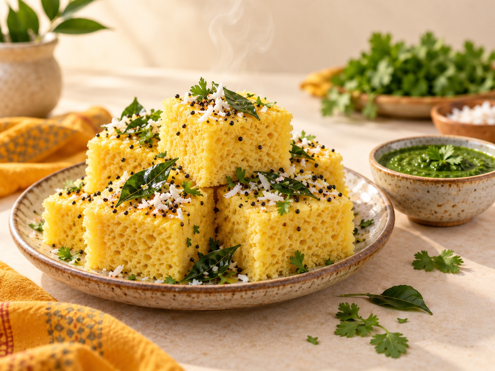

# Bansari Premixo — Website

A fast, mobile-first, bilingual (Gujarati + English) website for **Bansari Premixo**, a
family-run food premix / instant-mix business from Gujarat.

Built with plain **HTML + CSS + JavaScript** — no build tools, no frameworks, nothing to
install. Just open it in a browser. Products are data-driven so you can add new mixes by
editing **one file**.

---

## 📂 Files

| File | What it is |
|------|-----------|
| `index.html` | All the page content & sections |
| `styles.css` | All styling (colours, layout, responsive) |
| `products.js` | **👉 Your product list — edit this to add products** |
| `script.js` | Makes products, filters, menu & form work |
| `assets/` | Put your photos & logo here |

---

> **No Node.js, no build tools, nothing to install.** This is a plain static website
> (HTML + CSS + JavaScript). It runs directly in any browser and on GitHub Pages as-is.

## ▶️ How to run it locally

**Easiest:** double-click `index.html` — it opens in your browser. Done.

*(Optional)* If you want photos/scripts to load exactly like they will online, you can run a
tiny local server with something you already have — but this is **not required**:
```bash
# Python (already on most Macs) — optional convenience only
cd /Users/harikrushna/Herd/bansaripremixo
python3 -m http.server 8080     # then open http://localhost:8080
```

## 🌐 Publish free on GitHub Pages (recommended)

1. Create a new repository on GitHub (e.g. `bansaripremixo`).
2. Upload **all these files** (`index.html`, `styles.css`, `script.js`, `products.js`,
   `i18n.js`, and the `assets/` folder) to the repo — keep `index.html` at the **root**.
   - Via the website: *Add file → Upload files → drag everything in → Commit*.
   - Or via git:
     ```bash
     git init
     git add .
     git commit -m "Bansari Premixo website"
     git branch -M main
     git remote add origin https://github.com/<your-username>/bansaripremixo.git
     git push -u origin main
     ```
3. In the repo, go to **Settings → Pages**.
4. Under **Build and deployment → Source**, choose **Deploy from a branch**.
5. Pick branch **`main`** and folder **`/ (root)`**, then **Save**.
6. Wait ~1 minute. Your site goes live at
   `https://<your-username>.github.io/bansaripremixo/`.

Every time you edit `products.js` (or any file) and push/upload again, the live site updates
automatically. No configuration files needed.

*(Alternative: drag this folder onto [Netlify Drop](https://app.netlify.com/drop) for an
instant free link.)*

---

## ➕ How to add a new product (2 minutes)

1. Open **`products.js`**.
2. Copy one existing block (everything inside `{ ... }`) and paste it above the last `];`.
3. Change the values. Example:

```js
{
  name: "Dahi Vada Mix",
  guj: "દહીં વડા મિક્સ",
  category: "snacks",          // snacks | breakfast | sweets | other
  desc: "Soft vadas in creamy spiced yogurt — party ready.",
  price: "₹90",
  emoji: "⚪",                  // shows until you add a real photo
  image: "assets/dahivada.jpg",// optional — a real photo replaces the emoji
  tag: "New"                    // optional badge (or leave "")
},
```

4. Make sure every block ends with a **comma**, except you don't need one after the last block.
5. Save and refresh the browser. The card — and its category filter — appear automatically.

**Adding a new category?** Add it to the `CATEGORIES` list at the top of `products.js`
(e.g. `spices: "Spices / મસાલા"`), then use that key in a product's `category`.

---

## 🛒 How the cart & ordering works

Customers browse products and tap **Add to Cart** on any item. The cart (🛒 icon in the
header, with a live count) opens as a side panel where they can:

- Increase / decrease the quantity of each item (**+ / −**), or remove it (set to 0)
- See a running **total** (calculated from each product's `price`)
- Tap **Place Order on WhatsApp**

The **first time** a customer checks out, the cart asks for their **name, phone, and delivery
address**. These are saved in their browser, so on later orders the details are already filled
in (shown as "Deliver to …" with an **Edit** link) — they never have to type the address
again. Checkout builds a neatly formatted message like:

```
Hi Bansari Premixo! I'd like to place an order:

1. Dhokla Mix × 2 — ₹160
2. Gulab Jamun Mix × 1 — ₹110

Total: ₹270

Name: Aaradhya Shah
Phone: 98250 12345
Address: 12 Shivalik Bungalows, Shela, Ahmedabad, 380058

Please confirm availability and delivery. Thank you!
```

…and opens WhatsApp (to **+91 79846 86176**) with it pre-filled, so the customer just taps
send. The cart and saved details live in the browser, so they survive page refreshes.

> 💡 Totals use the number inside each product's `price` (e.g. `"₹80"` → 80). Keep a number in
> the price field for the total to work. If you write `"Price on request"`, that item counts
> as ₹0 in the total.

## 🖼️ Adding your real photos

1. Save your photo into the `assets/` folder (e.g. `assets/dhokla.jpg`).
   Use bright, well-lit, square-ish images ~800×600px for fast loading.
2. In `products.js`, set that product's `image` to `"assets/dhokla.jpg"`.
3. For the big **hero** and **about** photos, replace the dashed placeholders in `index.html`
   (search for `img-placeholder`) with an `` tag, e.g.:
   ```html
   
   ```

---

## 🖼️ About the current images

The photos in `assets/` are **free placeholder images** (Creative Commons, pulled from
[LoremFlickr](https://loremflickr.com)) so the site looks complete out of the box. Replace
them with your own real product photos before going live — just save your photo over the same
filename (e.g. `assets/dhokla.jpg`) and it appears automatically. No code change needed.

## ✏️ Things to update before going live

Already filled in for you:
- ✅ **Phone / WhatsApp**: `+91 79846 86176`
- ✅ **Address**: Near ClubO7, Shela, Ahmedabad, Gujarat

Still to replace when you have them:
- **Email / Instagram** — in `index.html` (Contact section & footer).
- **FSSAI licence number** — in the footer of `index.html` (currently `XXXX…`).
- **Domain** — the `canonical` and `og:image` URLs in `<head>`.
- **Real photos** — swap the free placeholder images in `assets/` (see above).

---

## 🎨 Brand & design direction

**Colours**
- Saffron / Turmeric `#E8A33D` — appetite, warmth (buttons, accents)
- Deep Green `#1F5E3D` — trust, freshness (headings, brand)
- Warm Cream `#FBF6EC` — clean, homely background
- Charcoal `#2B2622` — body text

**Fonts** — *Poppins* (modern headings) + *Mukta* (clean Gujarati + English body).

### Logo direction (pairs with the name & tagline)
The included placeholder logo (`assets/favicon.svg`) shows the idea: a **green roundel with a
saffron flute (bansuri)** whose holes double as **grains/dots**, and a small steam curl. Ideas
for your designer:

1. **Flute = grain**: a minimalist bansuri where the finger-holes become seeds/lentils —
   directly ties "Bansari" (flute) to premix ingredients.
2. **Bowl + steam + flute**: a warm bowl with a rising steam curl shaped like a subtle flute —
   says "ready-to-eat, home-style".
3. **Wordmark**: "Bansari" in a rounded friendly serif/Poppins with a tiny peacock-feather or
   flute accent over the "i"; add "પ્રીમિક્સો" underneath in Mukta for the bilingual identity.

Keep it a **circular badge** version too (works as a packet sticker, WhatsApp DP & favicon).
Keep it general (not a single dish) so it scales into spices & ready-to-cook later.

---

Made with ♥ for Bansari Premixo — *ઘર જેવો સ્વાદ, પળમાં તૈયાર.*
